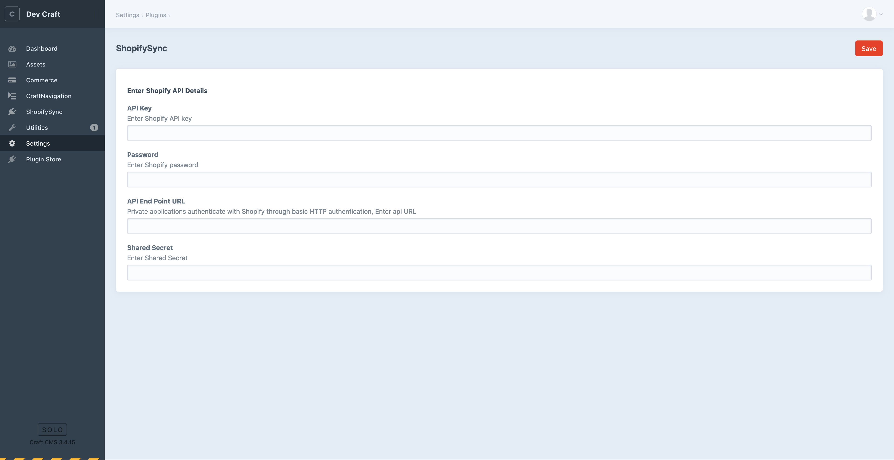

# ShopifySync plugin for Craft CMS 3.x

Import and Export Products from Shopify

## Requirements

This plugin requires Craft CMS 3.0.0-beta.23 or later.

## Installation

To install the plugin, follow these instructions.

1. Open your terminal and go to your Craft project:

        cd /path/to/project

2. Then tell Composer to load the plugin:

        composer require fatfishdigital/shopify-sync

3. In the Control Panel, go to Settings → Plugins and click the “Install” button for ShopifySync.

## ShopifySync Overview

This is very simple tool to import shopify product from shopify store to craft commerce store.

## Configuring ShopifySync

1. Enter the required details for the shopify plugin
2. Create Assets Volume and name it as "Image", this is very important and will be used to map the image field.

## Using ShopifySync

1. click on ShopifySync Menu on Left hand side.
2. Click on Import Products.

## ShopifySync Roadmap

Some things to do, and ideas for potential features:

* Release it

Brought to you by [Fatfish](www.fatfish.com.au)
